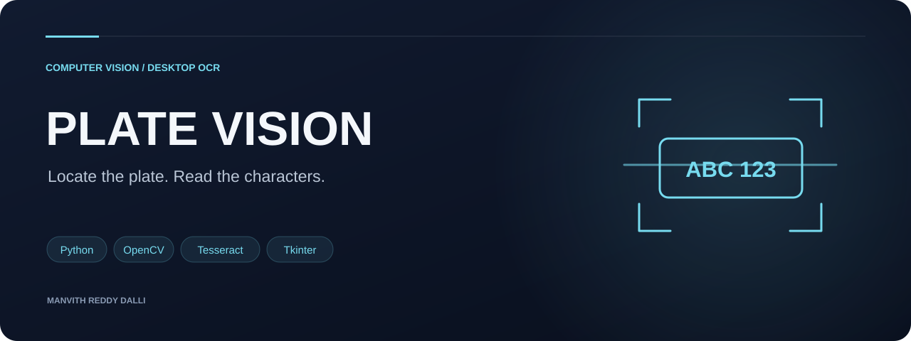
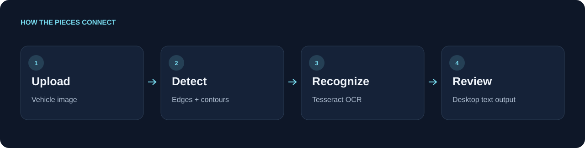

<p align="center"></p>

<h1 align="center">Number Plate Recognition</h1>

<p align="center">Locate the plate. Read the characters.</p>

<p align="center"><code>Python</code> &nbsp; <code>OpenCV</code> &nbsp; <code>Tesseract</code> &nbsp; <code>Tkinter</code></p>

<p align="center"><a href="#processing-pipeline">Processing pipeline</a> · <a href="#technology">Technology</a> · <a href="#run-locally">Run locally</a> · <a href="#repository-guide">Repository guide</a> · <a href="#engineering-considerations">Engineering considerations</a></p>

<table><tr><td width="33%" valign="top"><h3>Visual processing</h3><p>Grayscale, Sobel edges, thresholding, and morphology.</p></td><td width="33%" valign="top"><h3>Text extraction</h3><p>Tesseract reads detected number-plate regions.</p></td><td width="33%" valign="top"><h3>Simple desktop flow</h3><p>Upload an image and inspect the recognized text.</p></td></tr></table>

---

A Python desktop application that finds candidate number-plate regions using classical computer vision and extracts text with Tesseract OCR. A Tkinter interface lets users upload an image and run the recognition workflow.

## Processing pipeline



## Technology

| Purpose | Tools |
| --- | --- |
| Image processing | OpenCV, NumPy |
| Text extraction | Tesseract, pytesseract |
| Desktop interface | Tkinter |
| Image display | Pillow |

## Run locally

1. Install Python with Tkinter support and the Tesseract executable for your operating system. Make `tesseract` available on your PATH.
2. Create a virtual environment and install dependencies:

```sh
pip install -r requirements.txt
python main.py
```

3. Choose an image you have permission to use and select **Classify Image**.

## Repository guide

| File | Purpose |
| --- | --- |
| `main.py` | Main desktop recognition application |
| `gui.py` | Earlier interface with stricter geometry thresholds |
| `requirements.txt` | Python dependencies |

Optional `car.png` and `logo.png` artwork can be added locally. Sample vehicle photos and generated OCR images are excluded from this release.

## Engineering considerations

This educational prototype uses geometric heuristics rather than a learned detector. Recognition depends on lighting, image resolution, plate orientation, and contour quality. No accuracy benchmark is claimed. Python syntax was checked during source preparation; end-to-end execution requires a local desktop and Tesseract installation.

---
Explore more work in [Manvith Reddy Dalli’s portfolio](https://manvith-d.github.io/portfolio/) · [LinkedIn](https://www.linkedin.com/in/manvith-reddy-dalli-38a06a257)
