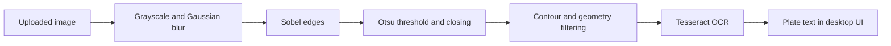

# Number Plate Recognition

**From a vehicle image to readable plate text.**

A Python desktop application that finds candidate number-plate regions using classical computer vision and extracts text with Tesseract OCR. A Tkinter interface lets users upload an image and run the recognition workflow.

## Processing pipeline



## Technology

| Purpose | Tools |
| --- | --- |
| Image processing | OpenCV, NumPy |
| Text extraction | Tesseract, pytesseract |
| Desktop interface | Tkinter |
| Image display | Pillow |

## Run locally

1. Install Python with Tkinter support and the Tesseract executable for your operating system. Make `tesseract` available on your PATH.
2. Create a virtual environment and install dependencies:

```sh
pip install -r requirements.txt
python main.py
```

3. Choose an image you have permission to use and select **Classify Image**.

## Repository guide

| File | Purpose |
| --- | --- |
| `main.py` | Main desktop recognition application |
| `gui.py` | Earlier interface with stricter geometry thresholds |
| `requirements.txt` | Python dependencies |

Optional `car.png` and `logo.png` artwork can be added locally. Sample vehicle photos and generated OCR images are excluded from this release.

## Engineering considerations

This educational prototype uses geometric heuristics rather than a learned detector. Recognition depends on lighting, image resolution, plate orientation, and contour quality. No accuracy benchmark is claimed. Python syntax was checked during source preparation; end-to-end execution requires a local desktop and Tesseract installation.

---
Explore more work in [Manvith Reddy Dalli’s portfolio](https://manvith-reddy-dalli.roo7001.chatgpt.site/) · [LinkedIn](https://www.linkedin.com/in/manvith-reddy-dalli-38a06a257)
